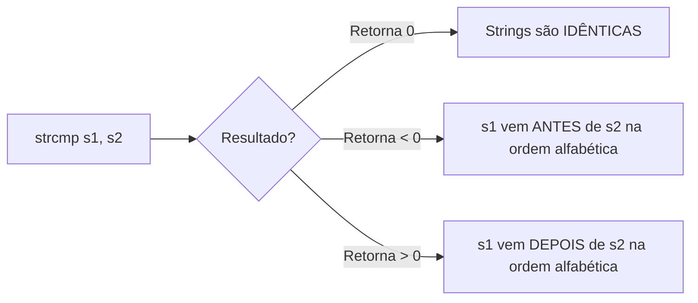
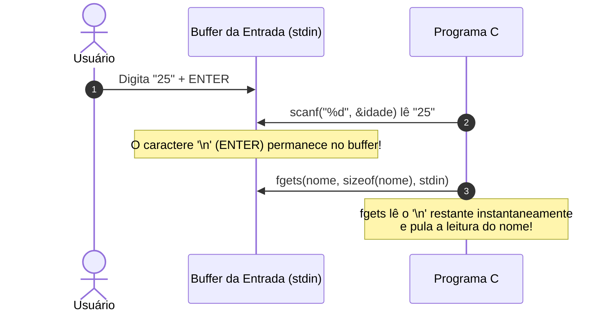

# 🔤 Manipulação de Strings em C

**Aulas de Programação em C**  
**Professora:** Andréia Rodrigues Casare  
**Última Atualização:** 09/2024  

---

## 🧠 Mapa Mental do Conteúdo

```mermaid
mindmap
  root((Strings em C))
    Biblioteca string.h
      Comparacao
        strcmp
      Copia
        strcpy
      Tamanho
        strlen
      Concatenacao
        strcat
      Busca e Indice
        strcspn
      Conversao Windows
        strupr
        strlwr
    Biblioteca ctype.h
      toupper
      tolower
    Buffer de Entrada
      Problema
        scanf deixa enter no buffer
      Solucao
        "fflush(stdin)"
        "getchar()"
```

---

## 📊 Tabela Comparativa de Funções de Strings

| Função | Biblioteca | Finalidade / O que faz | Retorno / Comportamento | Exemplo de Uso |
| :--- | :--- | :--- | :--- | :--- |
| `strlen()` | `<string.h>` | Conta a quantidade de caracteres de uma string | Retorna o tamanho como `int` (exclui `\0`) | `tam = strlen(str);` |
| `strcmp()` | `<string.h>` | Compara duas strings lexicograficamente | `0` (iguais), `<0` (str1 < str2), `>0` (str1 > str2) | `if (strcmp(s1, s2) == 0)` |
| `strcpy()` | `<string.h>` | Copia o conteúdo de uma string origem para a destino | Copia até encontrar `\0` | `strcpy(dest, orig);` |
| `strcat()` | `<string.h>` | Concatena (junta) a string origem ao final da destino | Adiciona no fim de `dest` | `strcat(dest, orig);` |
| `strcspn()` | `<string.h>` | Conta caracteres até encontrar um caractere proibido | Retorna o índice do caractere encontrado | `str[strcspn(str, "\n")] = '\0'` |
| `strupr()` | `<string.h>` | Converte **toda a string** para MAIÚSCULAS | Exclusivo para Windows / Não-padrão | `strupr(str);` |
| `strlwr()` | `<string.h>` | Converte **toda a string** para minúsculas | Exclusivo para Windows / Não-padrão | `strlwr(str);` |
| `toupper()` | `<ctype.h>` | Converte **um único caractere** para maiúsculo | Retorna o caractere em maiúsculo | `c = toupper(c);` |
| `tolower()` | `<ctype.h>` | Converte **um único caractere** para minúsculo | Retorna o caractere em minúsculo | `c = tolower(c);` |

---

## 🛠️ Detalhamento das Funções

### 1. 🔍 Comparação de Strings (`strcmp`)
A função `strcmp(s1, s2)` compara duas strings caractere por caractere segundo a ordem alfabética (tabela ASCII).



---

### 2. 📋 Copiando e Concatenando (`strcpy` e `strcat`)

- **`strcpy(destino, origem)`**: Copia o texto de `origem` para a variável `destino`.
- **`strcat(destino, origem)`**: Adiciona o texto de `origem` no final de `destino`.

> ⚠️ **Atenção:** Certifique-se de que a string de destino possui espaço suficiente para armazenar o resultado.

---

### 3. 🎯 Removendo o `\n` do `fgets` (`strcspn`)
A função `fgets()` lê a quebra de linha `\n` gerada ao pressionar a tecla `ENTER`. Para remover esse `\n` indesejado e substituir por `\0` (fim de string), usamos:

```c
nome[strcspn(nome, "\n")] = '\0';
```

---

### 4. 🔠 Conversão entre Maiúsculas e Minúsculas (`<ctype.h>`)
Como as funções `strupr()` e `strlwr()` não são portáveis (não pertencem ao padrão ANSI C), a boa prática é percorrer a string caractere por caractere utilizando `toupper()` ou `tolower()`:

```c
void para_maiusculas(char *s) {
    int i = 0;
    while (s[i] != '\0') {
        s[i] = (char)toupper((unsigned char)s[i]);
        i++;
    }
}
```

---

## ⚠️ Problema do Buffer de Entrada (`scanf` + `fgets`)

Quando utilizamos `scanf("%d", &idade)`, o número digitado é lido, mas a tecla **ENTER** (`\n`) permanece no **buffer de entrada**.



### ✅ Solução para Limpeza de Buffer:
* **No Windows:** `fflush(stdin);`
* **Portável (Linux/macOS/Windows):** `getchar();` ou `fpurge(stdin);`

---

## 💻 Exemplos de Código Práticos

### Exemplo 1: Comparando duas Palavras
```c
#include <stdio.h>
#include <string.h>

int main() {
    char msg[20], msg2[20];

    printf("Digite a 1ª palavra: ");
    fgets(msg, sizeof(msg), stdin);
    msg[strcspn(msg, "\n")] = '\0';

    printf("Digite a 2ª palavra: ");
    fgets(msg2, sizeof(msg2), stdin);
    msg2[strcspn(msg2, "\n")] = '\0';

    if (strcmp(msg, msg2) == 0) {
        printf("As strings são iguais!\n");
    } else {
        printf("As strings são diferentes!\n");
    }

    return 0;
}
```

---

### Exemplo 2: Concatenação Correta com Remoção de `\n`
```c
#include <stdio.h>
#include <string.h>

int main() {
    char nome[60], sobrenome[30];

    printf("Digite o nome: ");
    fgets(nome, sizeof(nome), stdin);
    nome[strcspn(nome, "\n")] = '\0'; // Remove o \n

    printf("Digite o sobrenome: ");
    fgets(sobrenome, sizeof(sobrenome), stdin);
    sobrenome[strcspn(sobrenome, "\n")] = '\0';

    strcat(nome, " ");
    strcat(nome, sobrenome);

    printf("Nome completo: %s\n", nome);
    return 0;
}
```

---

## 📝 Lista de Exercícios

| # | Título do Exercício | Descrição do Problema |
| :---: | :--- | :--- |
| **1** | 🔍 Busca em Vetor | Leia 15 nomes de pessoas e armazene num vetor. Permita buscar nomes repetidamente até que seja digitado `"FIM"`. |
| **2** | 📊 Contador de Caractere | Leia uma string e um caractere. Conte e exiba quantas vezes esse caractere aparece na string. |
| **3** | 🔄 Substituição de Caractere | Leia uma string, o caractere a ser alterado e o novo caractere. Substitua todas as ocorrências. |
| **4** | 🔄 Verificador de Palíndromo | Verifique se uma palavra é um palíndromo (ex: *RENNER*, *ANA*, *MIRIM*). |
| **5** | 🔐 Criptografia Simples | Criptografe uma frase digitada pelo usuário substituindo todas as vogais por `*`. |
